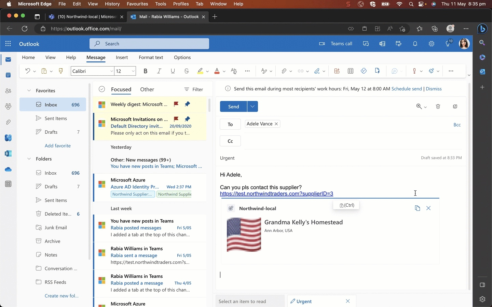
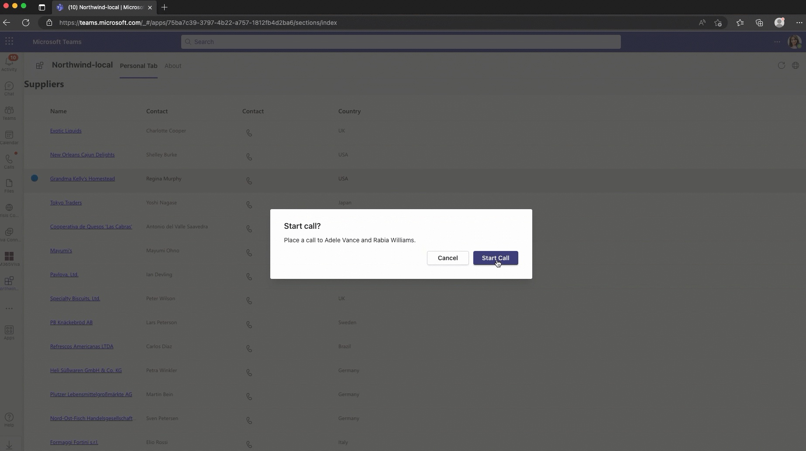
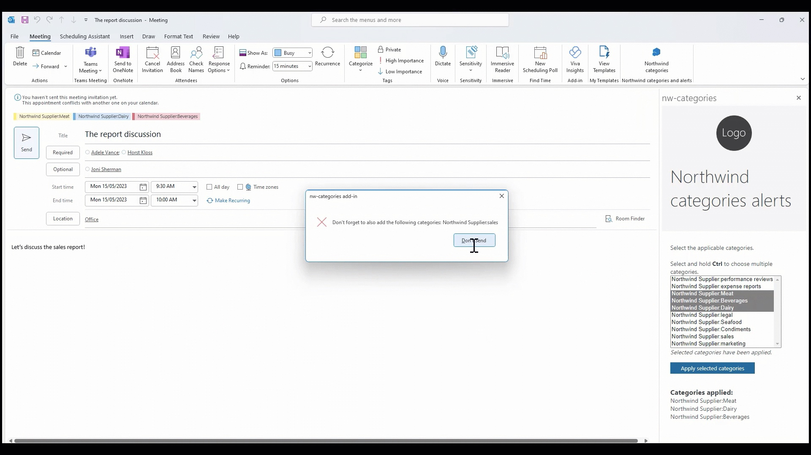

# Northwind Supplier

This app will have below Teams capabilities

- Message extension (search based)
- Link unfurling
- Pages with action
- Outlook add-in
- Personal tab
- Channel tab
- Meeting app

## Prerequisites

- [Node.js](https://nodejs.org/), supported versions:  16, 18
- An M365 account. If you do not have M365 account, apply one from [M365 developer program](https://developer.microsoft.com/microsoft-365/dev-program)
- [Set up your dev environment for extending Teams apps across Microsoft 365](https://aka.ms/teamsfx-m365-apps-prerequisites)

> Please note that after you enrolled your developer tenant in Office 365 Target Release, it may take couple days for the enrollment to take effect.

- [Teams Toolkit Visual Studio Code Extension](https://aka.ms/teams-toolkit) or [TeamsFx CLI](https://aka.ms/teamsfx-cli)

## Getting Started

Follow below instructions to get started with this application template for local debugging.

### Test your application with Visual Studio Code

1. Press `F5` or use the `Run and Debug Activity Panel` in Visual Studio Code.
1. Select a target Microsoft application where the message extension runs: `Debug in Teams`, `Debug in Outlook` and click the `Run and Debug` green arrow button.

## Try out

After side loading the app to Teams you can test out

### Message extension in Micrsoft Teams

Open Microsoft Teams, go to a conversation and select the ellipses in the chat compose area.
Find the app "Northwind-local" and search for "c" select the product "Chai" (Or do another search for another product) and it will insert the card into the chat area. Send the message.

### Message extension in Outlook

Open Outlook, create a new email. From the top ribbon select the Apps icons and choose "Northwind-local" app. Do the search and insert of cards similar to the instructions in Teams.


### Link unfurling in Teams and Outlook

Go to Teams chat or Outlook compose email and paste below link:

```lang-http
https://test.northwindtraders.com?supplierID=3

```

You can change the ID to 1 or 2.
The link should show a preview card automatically.



### Pages with action

After side loading the app open the app by "Adding" the personal tab.
The tab will list the suppliers dashboard.

In Teams you will see the contact information has a call button to call the contacts.
In Outlook launch the same personal tab/page and you will see a mail button to compose a mail to the contacts.



### Outlook add-in

To run outlook add-in you need a windows desktop app with Beta channel.
You'll need to choose the debug configuration `Outlook Desktop (Edge Chromium)` before selecting F5. Be sure you choose the configuration with "Desktop" in the name and _not_ just "Outlook"
This will sideload the add-in to Outlook.

The first time you run this add-in, you will get two prompts that need to be answered:

1. You will be prompted in the VS Code Terminal window:
"Allow localhost loopback for Microsoft Edge WebView? (Y/n)"
You will need to accept this for the add-in/debugging to work
2. There will be a Windows pop-up asking if you want to install a certificate into your machine's certificate store. You will need to accept this in order to proceed. Note:
Sometimes the window prompting this pops-up behind other windows. You may need to keep an keen eye out for it when you're running this for the first time.

To test:

Compose a new meeting and on the top ribbon select the "Northwind categories" add in, which will open a taskpane.
Select a category from the form (one or more categories) and apply to the mail. You will see colour coded labels on the top of the meeting.
Don't select `Northwind suppliers: sales` from the list. Compose email with body having "sales" in text.
Try to send the meeting request after filling the rest (Title, To, lLocation etc) of the form.
You will get a dialog prompt to add the `Northwind suppliers: sales`to the meeting before sending.



## References

- [Extend a Teams message extension across Microsoft 365](https://docs.microsoft.com/microsoftteams/platform/m365-apps/extend-m365-teams-message-extension?tabs=manifest-teams-toolkit)
- [Bot Framework Documentation](https://docs.botframework.com/)
- [Teams Toolkit Documentations](https://docs.microsoft.com/microsoftteams/platform/toolkit/teams-toolkit-fundamentals)
- [Teams Toolkit CLI](https://docs.microsoft.com/microsoftteams/platform/toolkit/teamsfx-cli)
- [TeamsFx SDK](https://docs.microsoft.com/microsoftteams/platform/toolkit/teamsfx-sdk)
- [Teams Toolkit Samples](https://github.com/OfficeDev/TeamsFx-Samples)
